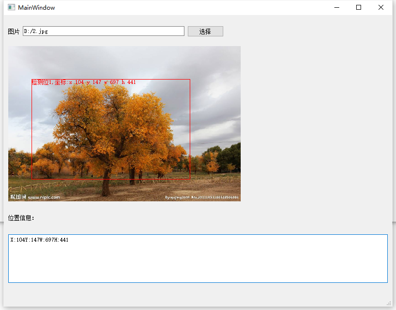
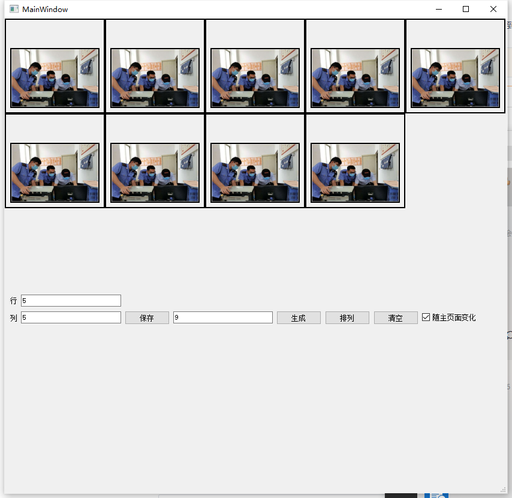
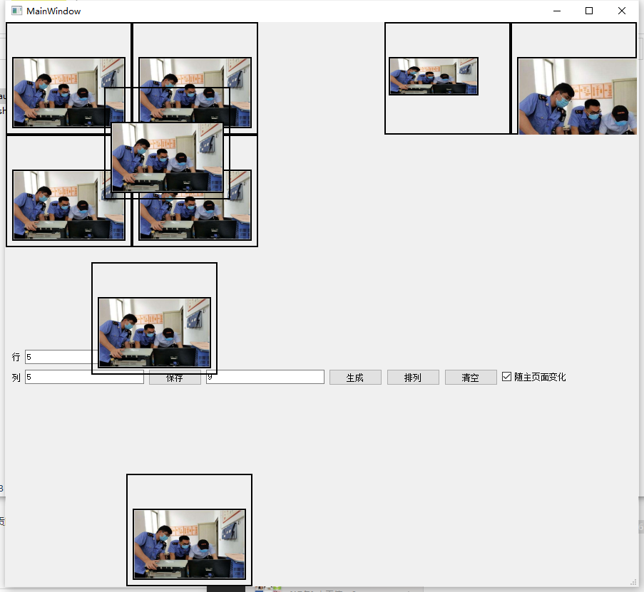

# AutoWidgetSizeTest

#### 介绍
可支持拉伸，自动根据行列排列，其他一些简单的小组件

软件架构说明

####
    1. 可拉伸，可寻边，可缩放的widget（label）控件
    2. 鼠标画框功能（类似QQ截屏功能，截取返回后的位置信息的图片即可）

####

#### 安装教程

#### 使用说明

#### 参与贡献

1.  牛顶顶

     
    
    
