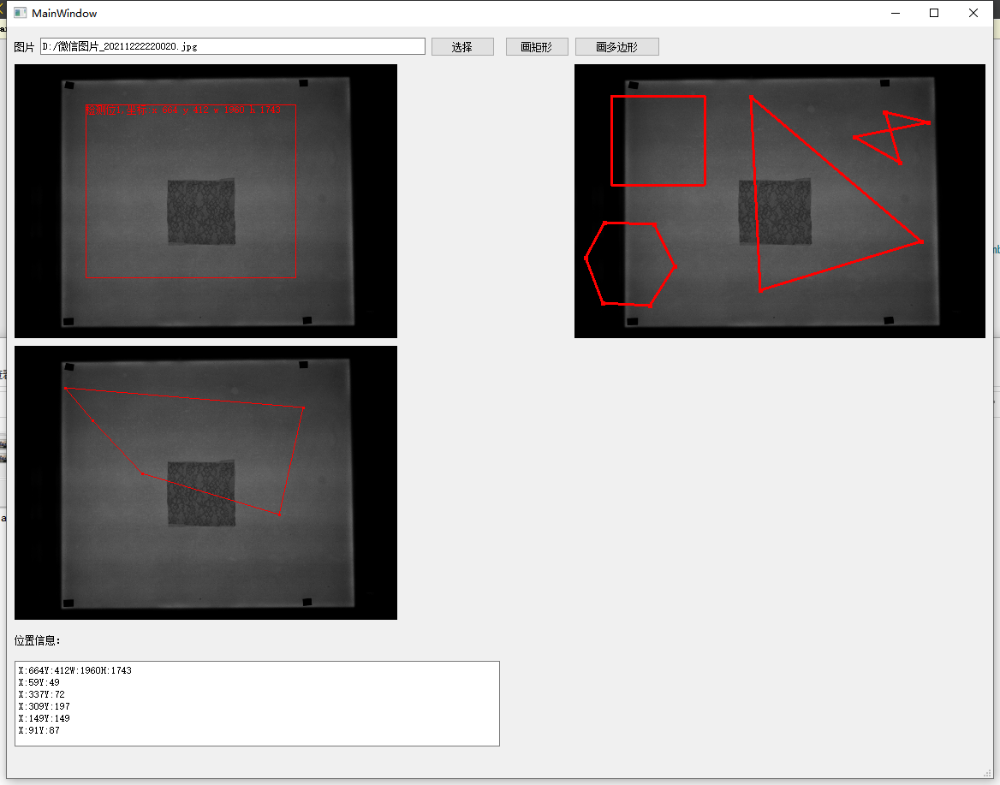
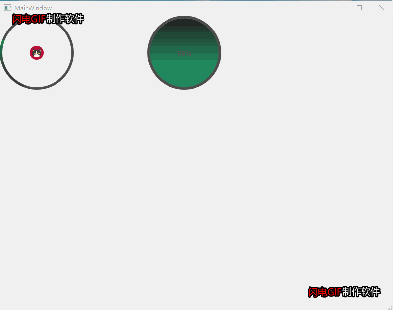

# AutoWidgetSizeTest

#### 介绍
可支持拉伸，自动根据行列排列，其他一些简单的小组件

软件架构说明

####
    1. 可拉伸，可寻边，可缩放的widget（label）控件
    2. 鼠标画框功能（类似QQ截屏功能，截取返回后的位置信息的图片即可）
    3. 进度条类的小控件（可设置文字，速度，图标，背景）
    4. 多边形绘制功能，结束后返回多边形轮廓，可自动闭合
    5. 增加多边形，矩形合并label，左键添加右键可删除
####
#### 数据结构算法（已实现）
####
    1.反转链表和单链表
    2.快速排序（左右分治，定义一个基准值，找到左边比基准值大的 右边比基准值小的互换，基准位和最后一次左边的位置互换位置，然后左右递归）
    3.冒泡排序（每次将最大或最小值后移）
####
#### 安装教程

#### 使用说明

#### 参与贡献

1.  牛顶顶

    
    
    
    
